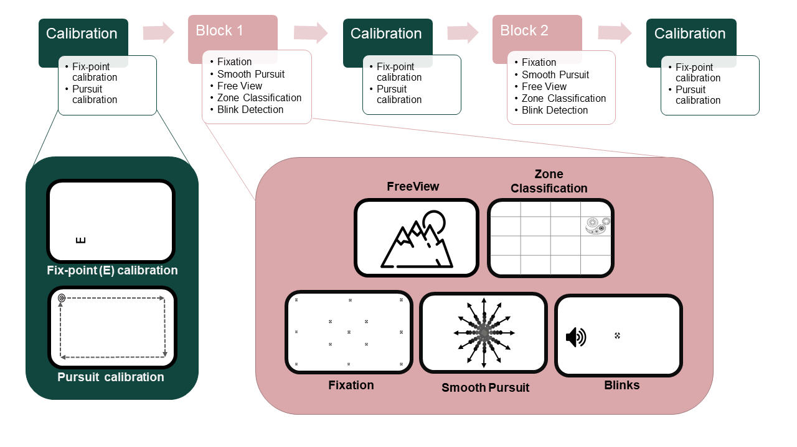

# Deep learning models for webcam eye-tracking in online experiments


> This repository contains analysis scripts that can be used to generate/replicate the plots and results reported in our paper.

<!-- This paper has been submitted for publication in *Some Journal*. -->
> We conducted an online experiment consisting applying a battery of eye tracking tasks that were performed by participants remotely. The recorded webcam videos and responses were used to analyse eye movements using state-of-the-art deep learning based methods and benchmark their performance on multiple measures. The experimental design of our online experiment was as below 



*For detailed explanation of task battery see Saxena et al.[^1] and Ehinger et al. [^9]*


<!-- ## Abstract -->


## Software implementation

> Gaze and blink predictions were evaluated using the following models.
> - MPIIGaze: https://github.com/hysts/pytorch_mpiigaze [^3]  
> - ETHXGaze:https://github.com/xucong-zhang/ETH-XGaze [^4]
> - FAZE: https://github.com/NVlabs/few_shot_gaze [^5]
> - RT_BENE: https://github.com/Tobias-Fischer/rt_gene [^6]

All source code used to analyse the predictions and generate figures in the paper are in this repository. 

Analysis and screening of participant data (See OSF pre-registration[^1]) is run using [Participant_Analysis.ipynb](Task_Analysis.ipynb)

Calibration analysis and comparison of different strategies for the ETRA paper (Saxena et al. 2022 [^2]) is run using [Calib_tests.ipynb](Calib_tests.ipynb)

Task-wise parsing of eye-tracking data and utility functions are provided in analysis scripts prefixed with "analysis_*.py"

Task-wise analysis are all run inside [Task_Analysis.ipynb](Task_Analysis.ipynb).

Anova tests on individual task performance and the 3x4 ANOVA across all 3 models and 4 tasks are run inside [Task_ANOVA.ipynb](Task_ANOVA.ipynb).

Saved dataframes and example data used in these files is provided in `csv_backup`


## Getting the code

A copy of all the files in this repository can be downloaded by cloning the
[git](https://github.com/ShreshthSaxena/Eye_Tracking_Analysis) repository:

  
```
git clone https://github.com/ShreshthSaxena/Eye_Tracking_Analysis.git
```

or [download a zip archive](https://github.com/ShreshthSaxena/Eye_Tracking_Analysis/archive/refs/heads/publish.zip).

<!-- A copy of the repository is also archived at *insert DOI here*
 -->

## Dependencies

Use the requirements.txt file to install all dependencies. The code was developed and run using python version 3.7.0

```
pip install -r requirements.txt
```


## License

All source code is made available under [CC BY-NC-SA 4.0](https://creativecommons.org/licenses/by-nc-sa/4.0/) license.


## References

[^1]: Shreshth Saxena, Lauren Fink and Elke Lange. 2021. An empirical experiment on deep learning models for tracking eye movements via webcam. OSF Pre-registration. https://osf.io/qh8kx

[^2]: Shreshth Saxena, Elke Lange, and Lauren Fink. 2022. Towards efficient calibration for webcam eye-tracking in online experiments. In 2022 Symposium on Eye Tracking Research and Applications (ETRA '22). Association for Computing Machinery, New York, NY, USA, Article 27, 1–7. https://doi.org/10.1145/3517031.3529645

[^3]: Xucong Zhang, Yusuke Sugano, Mario Fritz and Andreas Bulling. 2015. Appearance-based gaze estimation in the wild. Proceedings of the IEEE Computer Society Conference on Computer Vision and Pattern Recognition, 4511–4520. https://doi.org/10.1109/CVPR.2015.7299081.Google ScholarCross Ref

[^4]: Xucong Zhang, Seonwook Park, Thabo Beeler, Derek Bradley, Siyu Tang and Otmar Hilliges. 2020. ETH-XGaze: A large scale dataset for gaze estimation under extreme head pose and gaze variation. Lecture Notes in Computer Science (Including Subseries Lecture Notes in Artificial Intelligence and Lecture Notes in Bioinformatics), 12350 LNCS, 365–381. https://doi.org/10.1007/978-3-030-58558-7_22.Google Scholar

[^5]: Seonwook Park, Shalini De Mello, Pavlo Molchanov, Umar Iqbal, Otmar Hilliges and Jan Kautz. 2019. Few-shot adaptive gaze estimation. Proceedings of the IEEE International Conference on Computer Vision, 9367–9376. https://doi.org/10.1109/ICCV.2019.00946.Google ScholarCross Ref

[^6]: Cortacero, K., Fischer, T., & Demiris, Y. (n.d.). RT-BENE: A Dataset and Baselines for Real-Time Blink Estimation in Natural Environments. Retrieved October 8, 2021, from www.imperial.ac.uk/Personal-Robotics/

[^7]: Soukupová, T., & Cech, J. (2016). Real-Time Eye Blink Detection using Facial Landmarks.In 21st Computer Vision Winter Workshop, Rimske Toplice, Slovenia.

[^8]: Judd, T., Ehinger, K., Durand, F., & Torralba, A. (n.d.). Learning to Predict Where Humans Look. Proceedings of the IEEE 12th International Conference on Computer Vision, 2106–2113. https://doi.org/10.1109/ICCV.2009.5459462.

[^9]: Ehinger, B. V., Groß, K., Ibs, I., & König, P. (2019). A new comprehensive eye-tracking test battery concurrently evaluating the Pupil Labs glasses and the EyeLink 1000. PeerJ, 2019(7), 1–43. https://doi.org/10.7717/peerj.7086

[^10]: Truong, C., Oudre, L., & Vayatis, N. (2018). ruptures: Change point detection in Python (arXiv:1801.00826). arXiv. https://doi.org/10.48550/arXiv.1801.00826

[^11]: Cakmak, E., Plank, M., Calovi, D. S., Jordan, A., & Keim, D. (2021). Spatio-temporal clustering benchmark for collective animal behavior. Proceedings of the 1st ACM SIGSPATIAL International Workshop on Animal Movement Ecology and Human Mobility, 5–8. https://doi.org/10.1145/3486637.3489487


